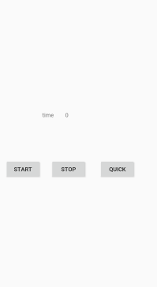
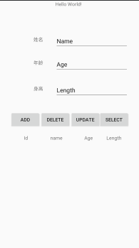

# AndroidExperiment

## First Semester

### experiment1

按钮监听测试

#### 实验内容

1. 建立一个Project， 包含App,Activity和对应的布局文件；
2. 创建模拟器，启动模拟器，编译运行应用程序；
3. 修改“Hello World！”为“我的第一个App！”；
4. 在Activity的底部中央添加一个按钮， 按钮上显示“测试”， 点击按钮后用Toast显示“测试成功！”。

#### 界面展示

### experiment2

观察生命周期

#### 实验内容

1. 建立一个Android Project, Activity名称为MainActivity, 设法观察全生命周期、可视生命周期和活动生命周的各个回调函数的回调时机和顺序；
2. 添加SecondActivity，并在MainActivity中添加按钮，点击后打开SecondActivity，观察2个Activity切换时各回调函数的回调情况；
3. 添加ThirdActivity，并在SecondActivity中添加按钮，点击后打开ThirdActivity，观察3个Activity切换时各回调函数的回调情况；
4. 先后修改SecondActivity和ThirdActivity的风格为对话框模式，观察3个Activity切换时各回调函数的回调情况。

#### 界面展示

## Second Semester

### experiment1

多线程程序设计

#### 实验内容

1. 创建一个Activity，在其中心显示一个秒表；
2. 创建一个后台服务，每隔1秒，去更新界面上的秒表上的数字1次----增1；
3. 点击界面上的“快进”按钮一次，将秒表计数增10；
4. 点击界面上的“停止”按钮，停止秒表更新

#### 界面展示

### experiment2

SQLite编程

#### 实验内容

1. 创建一个SQLiteOpenHelper子类
   1. 实现数据库创建功能；
   2. 实现升级功能；
2. 实现数据库的增删改查操作
   1. 上方控件中输入数值，点击添加，则将数据存入数据库中，同时下方的ListView添加一行；
   2. 点击下方的一行，则该行内容显示到上方的的控件中，修改其内容，然后点击修改按钮，则更新数据库和ListView；
   3. 先用（ii）中操作选择一行，然后点击删除按钮，则从数据库和界面中删除选中的数据；
   4. 上方输入年龄，点击查询按钮，则将查询结果（可能多个）用Toast显示出来。

#### 界面展示

