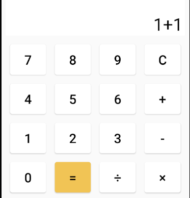
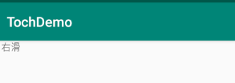

# AndroidExperiment

## First Semester

### experiment1

按钮监听测试

#### 实验内容

1. 建立一个Project， 包含App,Activity和对应的布局文件；
2. 创建模拟器，启动模拟器，编译运行应用程序；
3. 修改“Hello World！”为“我的第一个App！”；
4. 在Activity的底部中央添加一个按钮， 按钮上显示“测试”， 点击按钮后用Toast显示“测试成功！”。

#### 界面展示

### experiment2

观察生命周期

#### 实验内容

1. 建立一个Android Project, Activity名称为MainActivity, 设法观察全生命周期、可视生命周期和活动生命周的各个回调函数的回调时机和顺序；
2. 添加SecondActivity，并在MainActivity中添加按钮，点击后打开SecondActivity，观察2个Activity切换时各回调函数的回调情况；
3. 添加ThirdActivity，并在SecondActivity中添加按钮，点击后打开ThirdActivity，观察3个Activity切换时各回调函数的回调情况；
4. 先后修改SecondActivity和ThirdActivity的风格为对话框模式，观察3个Activity切换时各回调函数的回调情况。

#### 界面展示

### experiment3

音乐列表

#### 实验内容

1. 继承BaseAdapter之后，需要重写以下四个方法：getCount，getItem，getItemId，getView。
2. 先 getCount() 获取Item 的个数。 每绘制一次就调用一次getView() 方法，在getView 中将事先定义好的layout布局确定显示的效果并返回一个View对象作为一个Item 显示出来。
3. getItem() getItemId() 调用ListView 的响应的方法的时候调用到。
4. 创建一个listView item
5. 主要重写Adpter的 getCount() 。和getView() 方法

#### 界面展示

### experiment4

简单计算器

#### 实验内容

1. 设计一个简单的计算器的界面布局；
2. 实现四则混合运算，如2+3*4-5=9。

#### 界面展示

### experiment5

触摸监听

#### 实验内容

1. 实现触摸处理
   1. 为Activity添加触摸监听处理；
   2. 在OnTouch中通过MotionEvent判断触摸事件类型
   3. 自己设计算法判断：手指在屏幕上进行上下左右滑动时，并且达到一定的速度和距离，识别出“上划”“下划”“左划”“右划”等简单的手势动作；
2. 利用GestureDetector再次实现上述简单的手势识别
手指在屏幕上进行上下左右滑动时，并且达到一定的速度和距离，用Toast显示“上划”“下划”“左划”“右划”。

#### 界面展示

## Second Semester

### experiment1

多线程程序设计

#### 实验内容

1. 创建一个Activity，在其中心显示一个秒表；
2. 创建一个后台服务，每隔1秒，去更新界面上的秒表上的数字1次----增1；
3. 点击界面上的“快进”按钮一次，将秒表计数增10；
4. 点击界面上的“停止”按钮，停止秒表更新

#### 界面展示

### experiment2

SQLite编程

#### 实验内容

1. 创建一个SQLiteOpenHelper子类
   1. 实现数据库创建功能；
   2. 实现升级功能；
2. 实现数据库的增删改查操作
   1. 上方控件中输入数值，点击添加，则将数据存入数据库中，同时下方的ListView添加一行；
   2. 点击下方的一行，则该行内容显示到上方的的控件中，修改其内容，然后点击修改按钮，则更新数据库和ListView；
   3. 先用（ii）中操作选择一行，然后点击删除按钮，则从数据库和界面中删除选中的数据；
   4. 上方输入年龄，点击查询按钮，则将查询结果（可能多个）用Toast显示出来。

#### 界面展示

